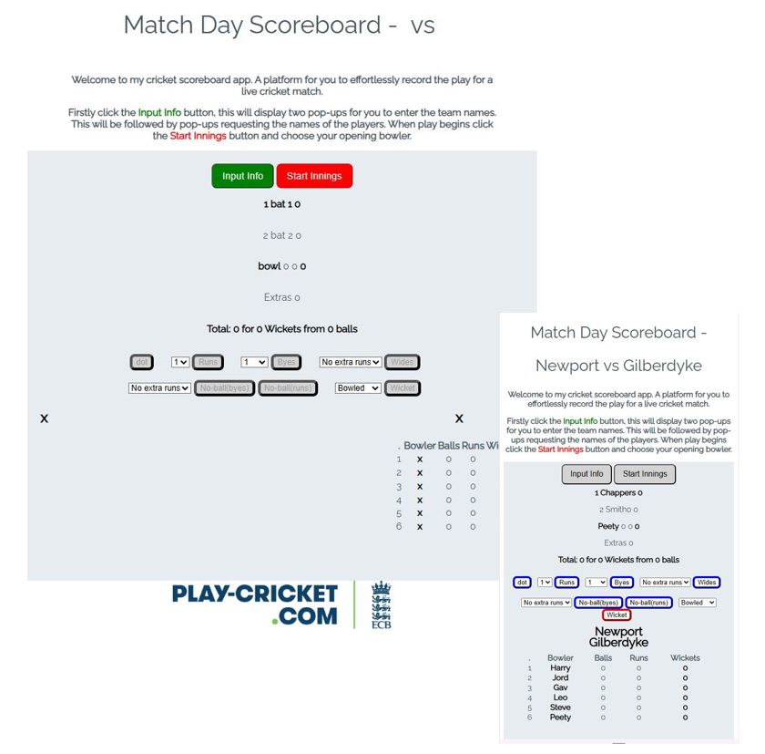
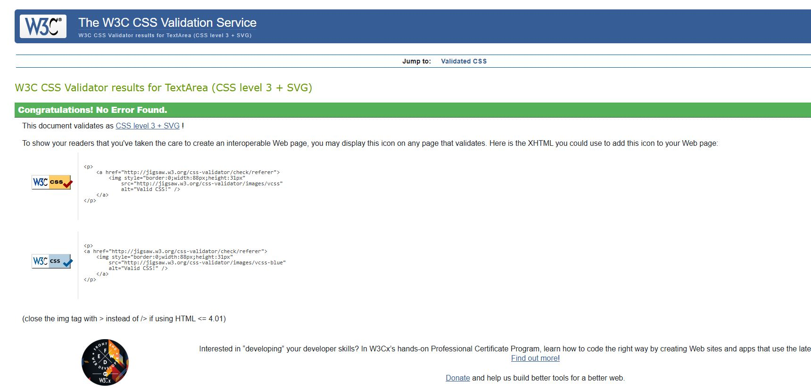

# Mile Stone Project 2 - Cricket Scorebook

For my Milestone Project 2 I am creating an interactive front end website.  This will use JavaScript to allow a user to score a cricket match.

For this instance the scoring will be to simulate a 6-aside 10 over match.

The purpose of the site is to allow a quick and easy method to score a match, requiring as few commands from the user as possible.

[Visit deployed website](https://johnnycockerill.github.io/milestone-project-2/)

## Table of Contents
1. [User Experience (UX)](#user-experience-ux)
    1. [Project Goals](#project-goals)
    2. [Target Audience](#target-audience)
    3. [User Goals](#user-goals)
    4. [Color Scheme](#color-scheme)
    5. [Typography](#typography)
    6. [Wireframes](#wireframes)
2. [Features](#features)
    1. [General](#general)
    2. [Landing Page](#landing-page)
    3. [Class Page](#class-page)
    4. [Contact Page](#contact-page)
    5. [Not Implemented](#features-left-to-be-implemted-in-future-releases)
3. [Technologies Used](#technologies-used)
    1. [Languages Used](#languages-used)
    2. [Frameworks, Libraries and Programs Used](#frameworks-libraries-and-programs-used)
4. [Testing](#testing)
    1. [Testing User Stories](#testing-user-stories)
    2. [Code Validation](#code-validation)
    3. [Accessibility](#accessibility)
    4. [Tools Testing](#tools-testing)
    5. [Manual Testing](#manual-testing)
5. [Finished Product](#finished-product)
6. [Deployment](#deployment)
    - [Github Pages](#github-pages)
7. [Credits](#credits)
    1. [Content](#content)
    2. [Media](#media)
    3. [Code](#code)
8. [Acknowledgements](#acknowledgements)

***

## User Experience (UX)

### Project Goals

- The website should have a calm, mellow look.  The user could potentially be using the site for prolonged periods so should be easy on the eyes.

- The range of options/controls should be clear and unambiguous, there could be a range of IT profiencies from users.

- Ultimately the site should detail the scores and winners of a cricket match.

### Target Audience

- The website is functional for a purpose, so would be used by any user looking to perform the function of scoring a cricket match.  With that in mind there are several aspects to consider:
    - The user could be of any gender, so appearances should remain neutral.
    - The user could be from any age range, so should not be cater for lighter colours for more lederly users.  Will also be considerate that minors may well use the site.
    - Whilst the website is intended to be as easy to use as possible, it is highly likely that the user will have a fair to strong understanding of cricket.

### User Goals

- As a user, I want to be able to navigate the controls intuitively and know which option to choose.

- As a user, I want to be able to clearly know how to start and end a match scoring event.

- As a user, I want to be able to see the live score as well as individuals peformances.

### Color Scheme

The primary colour used is a pastel grey (#E6ECF0), used purposely as an colour which is easy on the eyes in the event of prolonged use, but still allows for clear definition of the active area of the site.

  
Expand Colour #E6ECF0

  

### Typography

The main font used in the site is Raleway, with Sans-Serif as the fallback font in case Raleway is not being imported correctly.

The primary colour of for typography is a dark grey (#445361), following the same principles of the rest of the page would be easier on the eyes than black.

### Wireframes

  
Expand Index Page Wireframe

  

  
Expand Class Page Wireframe

  

  
Expand Contact Page Wireframe

  

## Features

### General

- Responsive design across multiple device sizes.
- Consistent colour scheme and design across all pages to enhance the user's navigation through the content.

#### Header

- The header contains the business name, in this instance it is also the purpose of site.

- The header contains an interactive element, upon beginning the scoring process the page title will update to display the team names entered by the user.

- The business name and page title will adjust in size and scale across screen sizes.

#### Footer

- The footer includes link to teams league page.

### Landing Page

#### Welcome Image and Text

- The Welcome main image is designed to attract the customer attention with a motivational feel, however not being too dominating and still allowing for a relaxed feel. The message is particularly aimed at attracting new customers looking for a relaxed village gym.
- A direct link to the schedule page is immediately provided below the welcome image, to allow returning customers to easily access the range of classes provided.

#### Main Content

- The main content is centred on the page.
    - Firstly a series of prompts will request information from the user, the inputs will be required for the javascript functions to run.
    - Once load function (and prompts) have completed the page will display a series of buttons, all labelled with specific commands for user interaction.

#### Begin Process

- Positioned below page title and above all other content will be a button labelled 'start innings', at this stage the button will be highlighted red to indicate this as a start point.  
- All other buttons will be grayed out and disabled to prevent the user calling functions in an order that would flaw the process.

#### Main Purpose

- Located in the centre of the page is the active area
  - This area holds a section detailing the active bowler and bats live statistics as well as the overall team total.
  - Below stats area is a series of buttons allowing the user to perform actions relating to a cricket match which will update the scores.
  - Located at the bottom of the active area is a section detailing all bowlers statistics as the match progresses. This area also shows the bats scores as they have been dismissed.

### Technologies Used

* [HTML5](https://en.wikipedia.org/wiki/HTML5)
* [CSS3](https://en.wikipedia.org/wiki/CSS)
* [JavaScript](https://simple.wikipedia.org/wiki/JavaScript)

### Frameworks, Libraries and Programs Used

* [Google Fonts](https://fonts.googleapis.com/)
    - Google Fonts was used to import the font Roboto and Exo into the style.css file. This font was used throughout the site.

* [GitPod](https://gitpod.io/)
     - GitPod was used for writing code, committing, and then pushing to GitHub.

* [GitHub](https://github.com/)
     - GitHub was used to store the project after pushing.

* [W3C Markup Validator](https://validator.w3.org/)
    - W3C Markup Validator was used to validate the HTML code.

* [W3C CSS Validator](https://jigsaw.w3.org/css-validator/)
    - W3C CSS Validator was used to validate the CSS code.

* [Bootstrap Library](https://getbootstrap.com/docs/4.0/components/carousel/)
    - Bootstrap was used for the image carousel.

## Testing

### Testing User Stories

- As a customer, I want to be able to navigate the website and controls intuitively.
    - The website has an intuitive, consistent structure and design allowing for easy navigation.
    - All similar command buttons are located in the same area of the page, buttons carrying a different style of function are styled to appear different

- As a customer, I want to be able to determine the outcome of a cricket match using this app.
    - The page will dtermine a winner based on the users input throughout the process.

- As a customer, I want to be able to clearly see how individual players performed.
    - There is a section of the page which shows the bowlers stats throughout the entire innings.
    - There is a section of the page which details bats scores who have already been dismissed as well as displaying the two active bats within the active scores area of the page.

- As a customer, I want to be able to have control of the input to allow for every action on the field.
    - The range of controls allows for user inputs in a clear and concise manner, mostly from one click.

### Code Validation

- W3 Validator has highlighted zero errors.

  
Expand W3 Index Validation

  

  
Expand W3 Class Validation

  

  
Expand W3 Contact Validation

  

 

- W3C Validator shows zero errors with CSS:

  
Expand W3C CSS Validation

  

### Accessibility

* Used Lighthouse in Chrome DevTools to confirm that the colors and fonts being used in throughout the website are easy to read and accessible.

  
Expand Lighthouse Report Desktop

  

  
Expand Lighthouse Report Mobile

  

### Tools Testing

* Responsiveness

    - [Responsive Design Checker](https://www.responsivedesignchecker.com/) was used to check responsiveness of the site pages on different screen sizes.
    
    - Chrome DevTools was used to test responsiveness in different screen sizes during the development process.

### Manual Testing

* Common Elements Testing

    - All Pages
        - **Navigation Bar**
            - Hovering the cursor over nav bar link prompts active effect.
            - Clicking on the navigation bar's links will bring the customer to the specified page.
        
        - **Footer**
            - Hovering the cursor over nav bar link prompts active effect.
            - Clicking on the social media links will open the specific website on a new tab.

    - Index Page

        - Image carousel works without input.
        - clicking on map, opens live Google maps onto correct location.

    - Class Schedule Page

        - Clicking classes ticks the box corresponding to that choice.
        - Form input requires all fields to have content.

    - Contact Page

        - Both form inputs require all fields to be populated.
        - The e-mail input field requires the correct e-mail format.

## Finished Product

## Deployment

* This website was developed using [GitPod](https://www.gitpod.io/), which was then committed and pushed to GitHub using the GitPod terminal.

### GitHub Pages

* Here are the steps to deploy this website to GitHub Pages from its GitHub repository:

    1. Log in to GitHub and locate the [GitHub Repository](https://github.com/).
    2. At the top of the Repository, locate the Settings tab on the menu.
    3. Scroll down the Settings page until you locate the Pages section.
    4. Under Build and deployment, select "Deploy from a Branch" from the Source dropdown list.
    5. Under Branch, select Main and /Root from the relevant dropdown lists, then click Save.

## Credits

### Content

- Content my own fictional work.

### Media

* [Hero Image - Aberdeen Sports Village](https://www.aberdeensportsvillage.com/imager/images/3463/20190831_AberdeenSportsVillage_NewGym_002_eaf97de94269862e8bb6a5cf5fce55e2.webp)

### Code

* [W3Schools](https://www.w3schools.com/) was consulted on a regular basis for inspiration and sometimes to be able to better understand the code being implement.

* [Bootstrap Library](https://getbootstrap.com/docs/4.0/components/carousel/)
    - Bootstrap was used for the image carousel.

## Acknowledgements

* My tutor, Rokon, for his tuition.
* My mentor, Marcel, for his feedback and guidance.
