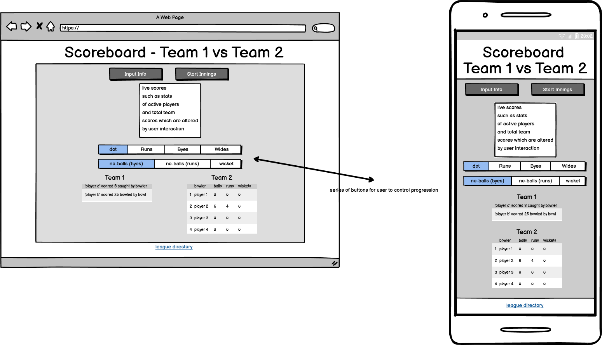
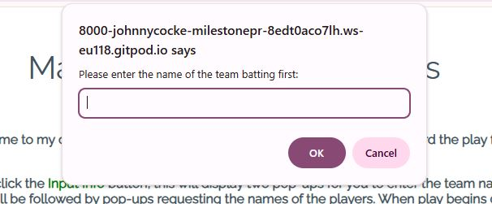
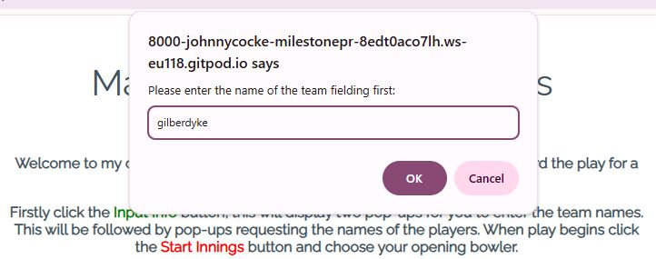
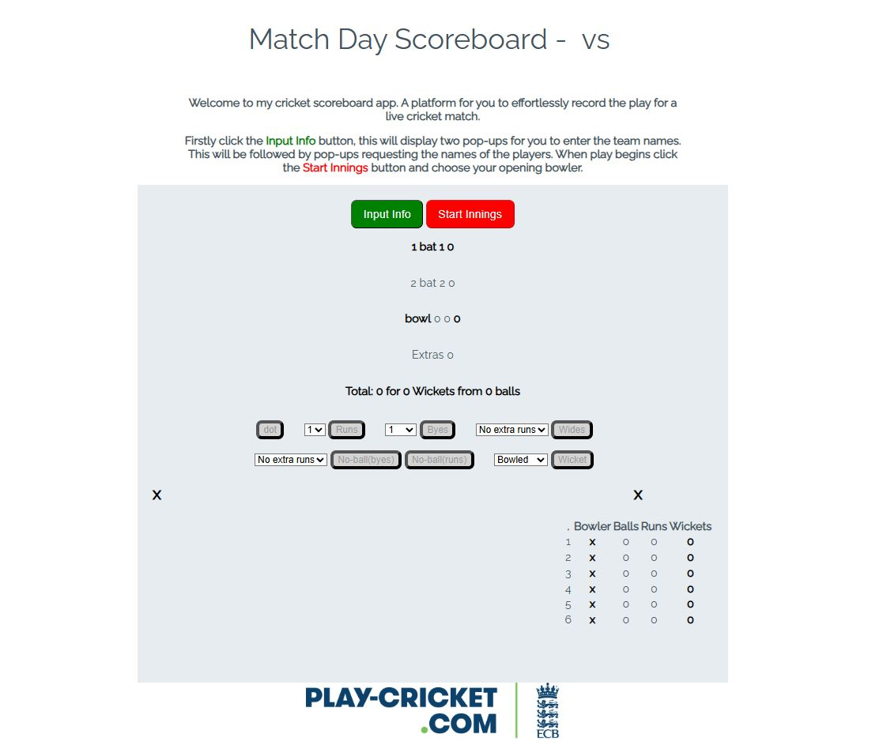
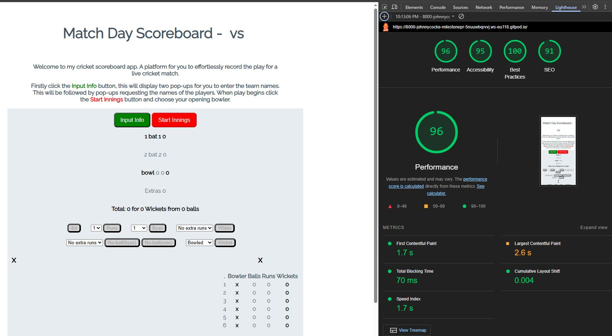

# Mile Stone Project 2 - Cricket Scorebook

For my Milestone Project 2 I am creating an interactive front end website.  This will use JavaScript to allow a user to score a cricket match.

For this instance the scoring will be to simulate a 6-aside 10 over match.

The purpose of the site is to allow a quick and easy method to score a match, requiring as few commands from the user as possible.

[Visit deployed website](https://johnnycockerill.github.io/milestone-project-2/)

## Table of Contents
1. [User Experience (UX)](#user-experience-ux)
    1. [Project Goals](#project-goals)
    2. [Target Audience](#target-audience)
    3. [User Goals](#user-goals)
    4. [Color Scheme](#color-scheme)
    5. [Typography](#typography)
    6. [Wireframes](#wireframes)
2. [Features](#features)
    1. [General](#general)
    2. [Landing Page](#landing-page)
    3. [Not Implemented](#features-left-to-be-implemted-in-future-releases)
3. [Technologies Used](#technologies-used)
    1. [Languages Used](#languages-used)
    2. [Frameworks, Libraries and Programs Used](#frameworks-libraries-and-programs-used)
4. [Testing](#testing)
    1. [Testing User Stories](#testing-user-stories)
    2. [Code Validation](#code-validation)
    3. [Accessibility](#accessibility)
    4. [Tools Testing](#tools-testing)
    5. [Manual Testing](#manual-testing)
5. [Finished Product](#finished-product)
6. [Deployment](#deployment)
    - [Github Pages](#github-pages)
7. [Credits](#credits)
    1. [Content](#content)
    2. [Media](#media)
    3. [Code](#code)
8. [Acknowledgements](#acknowledgements)

***

## User Experience (UX)

### Project Goals

- The website should have a calm, mellow look.  The user could potentially be using the site for prolonged periods so should be easy on the eyes.

- The range of options/controls should be clear and unambiguous, there could be a range of IT profiencies from users.

- This site should detail the scores of a cricket innings, holding the total and individuals figgures.

### Target Audience

- The website is functional for a purpose, so would be used by any user looking to perform the function of scoring a cricket match.  With that in mind there are several aspects to consider:
    - The user could be of any gender, so appearances should remain neutral.
    - The user could be from any age range, so should not be cater for lighter colours for more lederly users.  Will also be considerate that minors may well use the site.
    - Whilst the website is intended to be as easy to use as possible, it is highly likely that the user will have a fair to strong understanding of cricket.

### User Goals

- As a user, I want to be able to navigate the controls intuitively and know which option to choose.

- As a user, I want to be able to clearly know how to start and end a match scoring event.

- As a user, I want to be able to see the live score as well as individuals peformances.

- As a user, I want to be able to have control of the input to allow for every action on the field.

### Color Scheme

The primary colour used is a pastel grey (#E6ECF0), used purposely as an colour which is easy on the eyes in the event of prolonged use, but still allows for clear definition of the active area of the site.

### Typography

The main font used in the site is Raleway, with Sans-Serif as the fallback font in case Raleway is not being imported correctly.

The primary colour of for typography is a dark grey (#445361), following the same principles of the rest of the page would be easier on the eyes than black.

### Wireframes

## Features

### General

- Responsive design across multiple device sizes.
- Consistent colour scheme and design across all pages to enhance the user's navigation through the content.

#### Header

- The header contains the business name, in this instance it is also the purpose of site.

- The header contains an interactive element, upon beginning the scoring process the page title will update to display the team names entered by the user.

- The business name and page title will adjust in size and scale across screen sizes.

#### Footer

- The footer includes link to teams league page, in the form of the league icon.

### Landing Page

#### Welcome Image and Text

- The Welcome main image is designed to state the nature and purpose of the website.  It has been designed to a colour and size to contrast against the background and stand out.
- After first interaction with the website the welcome image will update to display the names of the two teams inputed by the user, these will update to have first letter capitalised regardless of how the user inputs.

#### Main Content

- The main content is centred on the page.
  - Firstly a series of prompts will request information from the user, the inputs will be required for the javascript functions to run.  All buttons barring one one will be disabled at this stage.

  

  
    
  - These required prompts run after the user clicks 'input info' button.  All other buttons will be disabled at this point.
  - Once load function (and prompts) have completed the page will display a series of buttons, all labelled with specific commands for user interaction.
- The live stats area will display 'bat 1', 'bat 2' and 'bowl' as the players names by default prior to beginning main purpose.  This area will display live individual stats and total team score as the game progresses.

  

- The controls area holds a series of buttons and drop-downs linked to buttons.  These are coloured when active and greyed out when disabled to improve user experience and help navigation through the process.
      
  

  

- At the bottom of page are the players stats area.  There are two panes, one for dismissed bats and one for individual bowlers stats which increase as the match progresses.
  - There is a sub heading for clarity displaying team name above respective players using the data inputted by the user earlier in the process.

  

  

  

  - These two panes will appear inline vertically on small screen sizes

#### Begin Process

- Positioned below page title and above all other content will be a button labelled 'start innings', at this stage the button will be highlighted red to indicate this as a start point.

  

- All other buttons will be grayed out and disabled to prevent the user calling functions in an order that would flaw the process.
  - Shading out all inactive buttons will aid the users navigation to next steps.

- Once 'Start Innings' button is clicked,  bowlers names and bat 1 and 2 will update with the data inputted by the user.  A prompt will also appear requesting the user to choose the opening bowler.

  

  Once selected the bowlers name will appear within the live scores area replacing the default 'bowl' name.

#### Main Purpose

- The user is free to choose any of the buttons to match the play of the match.  
  Each button updates all necessary stats requiring the user to click once reagrdless of match play.

- After every 6 legal balls (ie, not including wides or no-balls), a prompt will appear, requesting the user choose another bowler.
    - Note - The current bowler will not be an option for this process.
      
      

    Once chosen the new bowler will replace the existing bowler within the active scores area and the previous bowlers stats will be updated with the bowlers stats pane.
      - Should the bowler have been used already their existing stats will be added to.
      - The two active bats will be swapped, alternating the 'strike' characteristic.

- Should a bat be dismissed by using the 'wicket' button, the strike bat will be replaced with next bat in the order.
  - The departing bat's score will be dispalyed in the bats team pane.

      

- Whichever occurs first between loosing 5 wickets or reaching 10-overs initiates 'end of innings'.  The total score is logged and the two teams swap, beggining the process from fresh.

- Once a second innings is completed the score is logged.  A function runs to display which team won and their total scores.

### Features Left to be Implemeted in Future Releases

- The website could be linked to the league site, allowing users to view live scoresheets from other matches in the division or league.
- The team and player data could be part of a collective database, held by league server.
- The website would be developed to score both innings of a match, declaring a winner.

### Technologies Used

* [HTML5](https://en.wikipedia.org/wiki/HTML5)
* [CSS3](https://en.wikipedia.org/wiki/CSS)
* [JavaScript](https://simple.wikipedia.org/wiki/JavaScript)

### Frameworks, Libraries and Programs Used

* [Google Fonts](https://fonts.googleapis.com/)
    - Google Fonts was used to import the font Roboto and Exo into the style.css file. This font was used throughout the site.

* [GitPod](https://gitpod.io/)
     - GitPod was used for writing code, committing, and then pushing to GitHub.

* [GitHub](https://github.com/)
     - GitHub was used to store the project after pushing.

* [W3C Markup Validator](https://validator.w3.org/)
    - W3C Markup Validator was used to validate the HTML code.

* [W3C CSS Validator](https://jigsaw.w3.org/css-validator/)
    - W3C CSS Validator was used to validate the CSS code.

* [JavaScript Validator](https://jshint.com/)
    - JSHint JavaScript Validator was used to validate the JS code.

* [Bootstrap Library](https://getbootstrap.com/docs/4.0/components/carousel/)
    - Bootstrap was used for the image carousel.

## Testing

### Testing User Stories

Manual testing relies on human interaction to execute test cases and identify defects in a software application, while automated testing uses pre-written scripts to run tests repeatedly and efficiently, with the key principles being that manual testing is more flexible and exploratory, while automated testing prioritizes speed, consistency, and regression testing across repetitive tasks. 

- As a user, I want to be able to clearly know how to start and end a match scoring event.
  - The website requests necessary data from the user from autoload prompts, eliminating the chance the user will start the process without inputting all required inputs.
  - To begin the process a button is highlighted red and has hover function whilst this button is active.

- As a user, I want to be able to see the live score as well as individuals peformances.
  - All team scores and individual scores are visbible at all times whilst the process is live.

- As a customer, I want to be able to navigate the website and controls intuitively.
    - The website has an intuitive, consistent structure and design allowing for easy navigation.
    - All similar command buttons are located in the same area of the page, buttons carrying a different style of function are styled to appear different.
    - The website has interactive aids that assist the user, changing colour to highlight the next step or show disabled functions.

- As a customer, I want to be able to determine the outcome of a cricket match using this app.
    - The page will dtermine a winner based on the users input throughout the process.

- As a customer, I want to be able to clearly see how individual players performed.
    - There is a section of the page which shows the bowlers stats throughout the entire innings.
    - There is a section of the page which details bats scores who have already been dismissed as well as displaying the two active bats within the active scores area of the page.

- As a customer, I want to be able to have control of the input to allow for every action on the field.
    - The range of controls allows for user inputs in a clear and concise manner, mostly from one click.
    - These controls are colour coordinated by active and disabled.

### Code Validation

- W3 Validator has highlighted zero errors.

  
 

- W3C Validator shows zero errors with CSS:

  
 

- JSHint Validator shows zero errors, however 134 warnings all relating to mozilla browser compatability.

  
 

### Accessibility

* Used Lighthouse in Chrome DevTools to confirm that the colors and fonts being used in throughout the website are easy to read and accessible.

  

  

### Tools Testing

* Responsiveness

    - [Responsive Design Checker](https://www.responsivedesignchecker.com/) was used to check responsiveness of the site pages on different screen sizes.
    
  

  

  

    - Chrome DevTools was used to test responsiveness in different screen sizes during the development process.

### Manual Testing

* Common Elements Testing
        
    - Index Page

        - Team Name prompts appear without request on all screen sizes. - $${\color{green}PASS}$$
        - Player Name prompts appear without request. - $${\color{green}PASS}$$
        - Start innings hover effect works on desktop screen size. - $${\color{green}PASS}$$
        - All other buttons are grey and have no effect prior to 'start innings function'. - $${\color{green}PASS}$$
        - Start innings turns grey and has no effect following 'start innings' function- $${\color{green}PASS}$$
        - 'Start Innings' function produces bowling choice prompt. - $${\color{green}PASS}$$
        - All buttons produce desired effect, ie, a 'dot' or 'wide' alters the expected data, both visible and within object array. - $${\color{green}PASS}$$
        - 'Wicket' button produces desired result, replaces strike bat with the next bat on the list, shows the dismissed bat and their score within the correct pane. - $${\color{green}PASS}$$
        - Every 6th legal ball produces a prompt requesting user to choose an alternative bowler. - $${\color{green}PASS}$$
        - At bowler change the bats alternate strike. - $${\color{green}PASS}$$
        - At bowler change the stats are updated in correct pane and active bowler stats are changed. - $${\color{green}PASS}$$
        - After 5th wicket or 10th over the end of innings is dispalyed with score. - $${\color{red}FAIL - Not-implemented-yet}$$
        - After end of innings the teams and players names are reversed. - $${\color{red}FAIL - Not-implemented-yet}$$
        - Second Innings plays out in same way as first. - $${\color{red}FAIL - Not-implemented-yet}$$
        - After 5th wicket or 10th over of second innings prompt displays total scores and winning team. - $${\color{red}FAIL - Not-implemented-yet}$$

        - **Footer**
          - Hovering the cursor over nav bar link prompts active effect. $${\color{green}PASS}$$
          - Clicking on the league site link will open the specific website on a new tab. $${\color{green}PASS}$$

## Finished Product

## Deployment

* This website was developed using [GitPod](https://www.gitpod.io/), which was then committed and pushed to GitHub using the GitPod terminal.

### GitHub Pages

* Here are the steps to deploy this website to GitHub Pages from its GitHub repository:

    1. Log in to GitHub and locate the [GitHub Repository](https://github.com/).
    2. At the top of the Repository, locate the Settings tab on the menu.
    3. Scroll down the Settings page until you locate the Pages section.
    4. Under Build and deployment, select "Deploy from a Branch" from the Source dropdown list.
    5. Under Branch, select Main and /Root from the relevant dropdown lists, then click Save.

## Credits

### Content

- Content is my own fictional work.

### Media

* [League Website - Play Cricket (ECB)](https://s3-eu-west-1.amazonaws.com/pc-static.ecb.co.uk/images/logo.png)

### Code

* [W3Schools](https://www.w3schools.com/) was consulted on a regular basis for inspiration and sometimes to be able to better understand the code being implement.

* [Stack Overflow](https://www.stackoveflow.com/) was consulted on a regular basis for inspiration and sometimes to be able to better understand the code being implement.

## Acknowledgements

* My tutor, Len Johnson, for his tuition.
* My mentor, Marcel, for his feedback and guidance.
